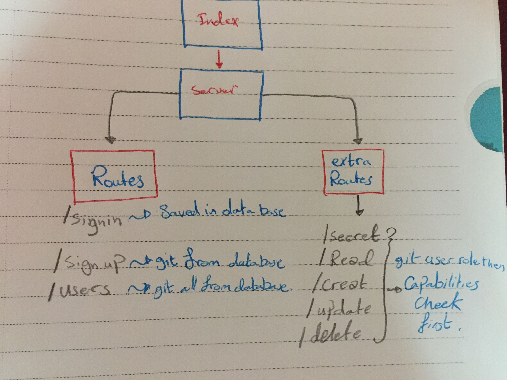

# auth-server
Express server that implements Basic Authentication, with signup and signin capabilities, using a Mongo database for storage.

**API to serve data**
we will have these `routes` for this app:
* `/signin` 
* `/signup` 
* `/users` 

### Author: Yasmin Adaileh :sunglasses:

### Links and Resources :paperclip:

[Submission PR](https://github.com/yasmin-401-advanced-javascript/auth-server/pull/5)

## Library Used

- `express`
- `bcryptjs` 
- `dotenv` 
- `jsonwebtoken` 
- `mongoose` 
- `morgan` 

## Instruction How to Install the Library

1. `npm i express` run it in the command line(Ubuntu)
1. `npm i -D jest` run it in the command line(Ubuntu)
1. `npm i -D @code-fellows/supergoose` run it in the command line(Ubuntu)
1. `npm i cors ` run it in the command line(Ubuntu)
1. `npm i mongoose` run it in the command line(Ubuntu)
1. `npm i morgan` run it in the command line(Ubuntu)
1. `npm i dotenv` run it in the command line(Ubuntu)
1. `npm i bcryptjs` run it in the command line(Ubuntu)
1. `npm i jsonwebtoken` run it in the command line(Ubuntu)

## How to run the app? :runner:

in the **Ubuntu** just type:
- `nodmon`
- `http://localhost:3000/`

after sign-in to check the **capabilities**:
- `/secret`
- `/create`
- `/update`
- `/delete`
- `/read`

## UML

